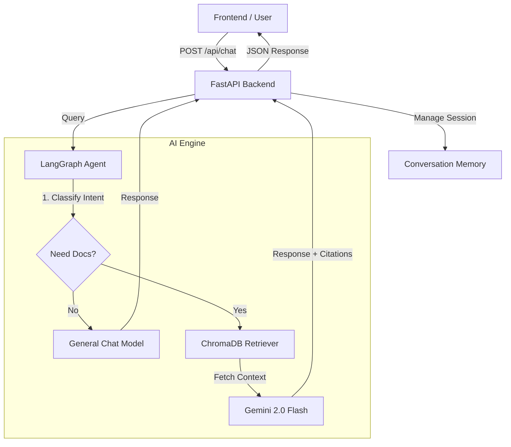

# Nigeria Tax Reform Bills Q&A Assistant

### Backend & AI Engine

**Project:** Agentic RAG Capstone  
**Team Role:** Backend & AI Engineering  
**Status:** Production Ready

---

## Overview

This repository contains the complete server-side infrastructure for the **Nigeria Tax Reform Q&A Assistant**.  
It combines a state-of-the-art **Agentic AI Engine** (built with **LangGraph** and **Google Gemini**) with a robust **FastAPI** backend to serve intelligent, citation-backed answers to frontend clients.

---

## Key Features

### AI Engine

- **Agentic Workflow** – Intelligent decision-making on when to retrieve documents versus when to respond conversationally.
- **Conditional Retrieval** – Reduces latency and cost by querying the vector database only for policy-related questions.
- **Citation-Backed Answers** – All policy claims are grounded in official **2024 Nigeria Tax Reform Bills**.
- **Conversation Memory** – Maintains multi-turn context (e.g., “What about VAT?” following “Will I pay more tax?”).

### Backend API

- **FastAPI Implementation** – High-performance, asynchronous REST API.
- **Auto-Healing Data Layer** – Detects empty vector databases and automatically triggers document ingestion on startup.
- **Session Management** – Handles user sessions and conversation history.
- **CORS Enabled** – Ready for React / Next.js frontend integration.

---

## System Architecture



---

## Project Structure

```
.
├── ai_engine/                # Core AI Logic
│   ├── documents/            # PDF Data Source (Tax Bills)
│   ├── chroma_db/            # Vector Database (Auto-generated)
│   ├── agent.py              # LangGraph State Machine
│   ├── config.py             # Settings & Paths
│   ├── document_processor.py # Ingestion Pipeline
│   ├── vector_store.py       # Embedding & Retrieval Logic
│   └── memory.py             # Conversation History
│
├── backend/                  # API Layer
│   ├── main.py               # FastAPI Server Entrypoint
│   └── requirements.txt      # Backend Dependencies
│
├── requirements.txt          # AI Engine Dependencies
└── .env                      # API Keys & Configuration
```

---

## Getting Started

### 1. Prerequisites

- Python **3.10+**
- Google **Gemini API Key**

### 2. Installation

Clone the repository and set up your environment:

```bash
# Create virtual environment
python -m venv venv
source venv/bin/activate  # Windows: venv\Scripts\activate

# Install dependencies
pip install -r ai_engine/requirements.txt
pip install -r backend/requirements.txt
```

---

## 3. Environment Configuration

Create a `.env` file in the project root:

```env
GEMINI_API_KEY=your_google_api_key_here

# Optional tuning
LLM_MODEL=gemini-2.0-flash-exp
EMBEDDING_MODEL=text-embedding-004
TEMPERATURE=0.1
CHUNK_SIZE=1000
CHUNK_OVERLAP=200
```

---

## 4. Data Setup (Auto‑Ingestion)

1. Place all PDF documents inside:

   ```
   ai_engine/documents/
   ```

2. On first startup, the system will automatically:
   - Check if the vector database exists.
   - Scan and process all PDFs.
   - Chunk, embed, and store them in `ai_engine/chroma_db/`.

**Manual ingestion (fallback):**

```bash
python -m ai_engine.vector_store
```

---

## Running the Server

Start the application from the project root:

```bash
python -m backend.main
```

- **API Base URL:** `http://localhost:8000`
- **Interactive Docs (Swagger):** `http://localhost:8000/docs`

---

## API Documentation

### 1. Chat Endpoint

**POST** `/api/chat`

Handles user interaction with the AI agent.

**Request**

```json
{
  "session_id": "unique_user_id",
  "message": "Will small businesses pay VAT?",
  "history": []
}
```

**Response**

```json
{
  "session_id": "unique_user_id",
  "response": "Small businesses with turnover less than N50m are exempt...",
  "sources": [
    {
      "document": "Nigeria Tax Bill 2024.pdf",
      "type": "pdf",
      "score": 0.65,
      "excerpt": "..."
    }
  ],
  "retrieved": true,
  "timestamp": "2026-01-08T12:00:00"
}
```

---

### 2. Health Check

**GET** `/health`

```json
{
  "status": "healthy",
  "ai_engine": "connected"
}
```

---

## Testing

### Test AI Engine Independently

Run the AI engine without the API server:

```bash
python -m ai_engine.main
```

### Test Retrieval Quality

Inspect similarity scores and debug retrieval:

```bash
python debug_retrieval.py
```

---

## Contributors

**Samuel Dasaolu** – AI Engineer  
_Agent Logic, RAG Pipeline, API Integration, System Architecture_

---

Built with **LangGraph**, **FastAPI**, and **Google Gemini**.
